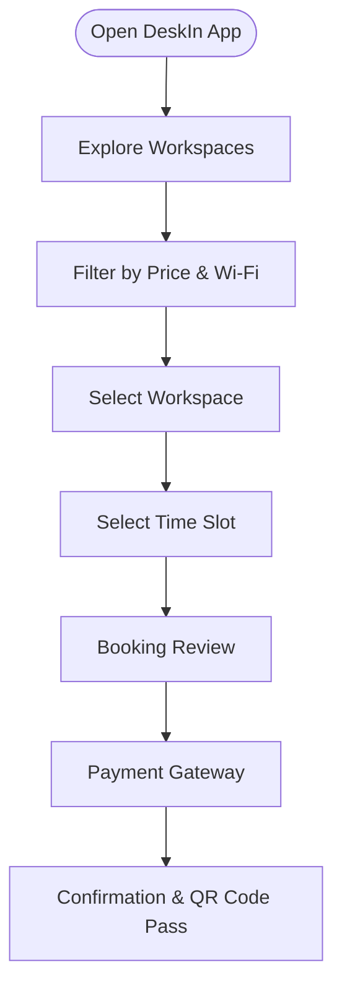
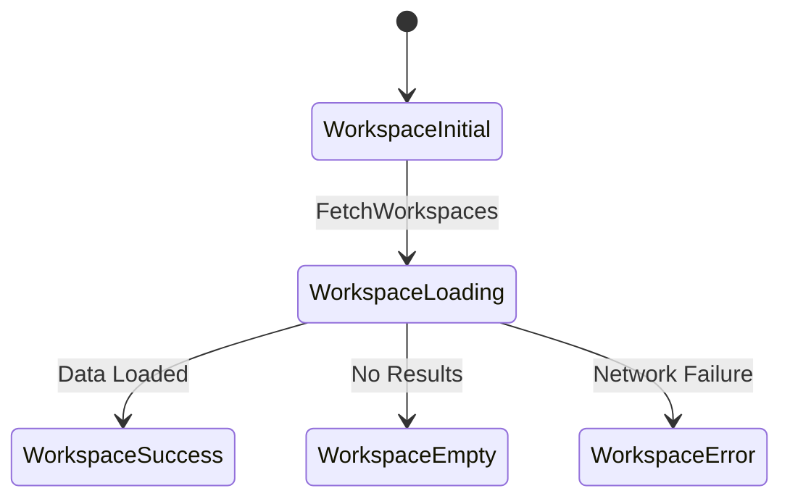

# 🏢 DeskIn - Workspace Booking Mobile Application

> A modern Flutter mobile application designed to simplify workspace discovery and real-time desk/meeting room bookings for freelancers, students, and startups in Egypt.

---

## 📌 About The Project

Finding quiet, well-equipped workspaces or private meeting rooms in Egypt often involves manual calls, WhatsApp back-and-forth, or facing double-booking issues upon arrival. 

**DeskIn** solves this business problem by providing a seamless, end-to-end mobile experience where users can search, filter by amenities (like Wi-Fi speed and price), select time slots in real time, and manage their reservations instantly.

The project follows a **Product-Driven Engineering** methodology:
`Business Need` ➔ `BRD` ➔ `PRD` ➔ `User Flows & Diagrams` ➔ `Clean Architecture Setup` ➔ `Flutter Implementation`.

---

## 📄 Product & Technical Documentation (`/docs`)

To ensure clear requirements before writing code, comprehensive documentation and visual diagrams were prepared in the [`/docs`](./docs) directory:

* 📑 [**Business Requirements Document (BRD)**](./docs/01_BRD.md): Defines business problems, high-level objectives, key performance metrics, and core business rules.
* 📑 [**Product Requirements Document (PRD)**](./docs/02_PRD.md): Outlines Epics, User Stories, and Acceptance Criteria (AC) mapped directly to UI states.
* 📑 [**User Flows & Edge Cases**](./docs/03_USER_FLOWS.md): Detailed happy paths, system edge cases (offline handling, concurrent booking), and interactive Mermaid User Flow diagrams.
* 📑 [**Technical Architecture**](./docs/04_ARCHITECTURE.md): Explains Clean Architecture layers, Data Transfer Objects (DTOs), and BLoC State Diagrams[cite: 1].

---

## 🎨 Visual System Diagrams

### 1. User Journey & Booking Flow
Below is the core interaction flow from user entry to QR code generation[cite: 1]:


  
### 2. State Management Cycle (BLoC)
Mapping PRD Acceptance Criteria to Flutter Presentation States:


### Technical Architecture & Tech Stack
DeskIn is built following Clean Architecture principles to ensure scalable, testable, and maintainable code.
```lib/
├── core/                  # Shared utilities, themes, network clients, failures
└── features/              # Feature-based modular structure
    └── workspace_booking/
        ├── data/          # Models, Remote Data Sources, Repository Implementations
        
        └── presentation/  # Cubit/BLoC State Management, UI Screens, Widgets
```

### Key Technologies & Packages
Framework: Flutter (Dart)

Architecture: Clean Architecture

State Management: BLoC / Cubit

Dependency Injection: GetIt / Injectable

Networking: Dio + Retrofit (RESTful API)

Diagrams: Mermaid.js

###  Getting Started
1- Clone the repository:
    git clone [https://github.com/amllsaied/DeskIn.git](https://github.com/amllsaied/DeskIn.git)

2- Navigate to project directory:
    cd DeskIn
3- Get dependencies:
    flutter pub get
4- Run the application: 
    flutter run  